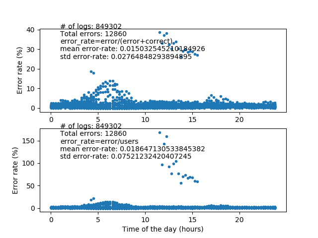
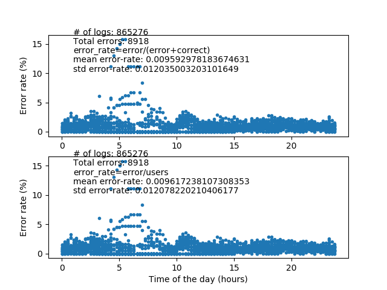
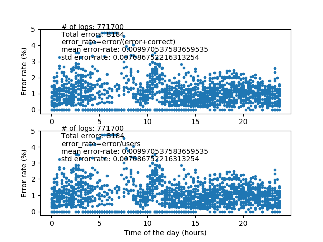

##### Name: Josep Carreras
###### Main Assigment Session 1
###### Finished on: Mon 1st of April 2019
###### Due on: Wed 3rd of April 2019

# ASSIGNEMENT SESSION 1

In this assignment, we've got two different logs from a travel website, where the users' transactions may result in either *correct* or *error*. Each transaction is marked with a timestamp. After analyzing the data from August, the whole team is challenged to reduce the number of errors for the following month, September. They will receive a salary bonus if they succeed. 

**Owing to all the data available, do they deserve the bonus?**

## TOOLS
Data have been downloaded from the given aws s3 bucket:
*s3://data.public.bdatainstitute.com/dam18/search_logs/2018/09/2018_09_18452212_log.json*

Python 3.7 has been used as the only required tool throughout this document.

First off, let's analyze the data trends over a whole day for the two months:

It is difficult to extract anything new from this view, apart that the numbers of users in August was **843.553** and **863.919** in September.

## NAIVE APPROACH

If we analyze the raw data without checking for potential outliers, we are to be in the wrong path. As an example, we can analyze the data we have at hand and calculate the error rate throughout a day, resulting in the two figures below.

#### Error rate, AUGUST: 

#### Error rate, SEPTEMBER:

To judge from the plots above, one would conclude that the  errors in September have significantly decreased, going from an average error rate of 1.50% in August to 0.96% in September, which means that the team has at least partially done the job and probably deserves a good fraction of the bonus.

## FINE OBSERVATION OF DATA RELIABILITY AND POTENTIAL OUTLIERS

However, working solely with average errors may seem to much for an avid data scientist. One may wonder about what is the distribution of errors throughout a month, in the hope of finding some data representative of unusual or malfunctioning conditions that could be biasing the whole sampling process.

Indeed, a more detailed analysis reveals to peculiarities of the data sets:

- For each log, the reported number of users does not always equal the sum of the reported quantities error + correct, being the sum sometimes greater than the number of users. This only happens in **292** logs of August and in **449** cases in September.
- If the data are averaged at each date and represented along a month, something interesting comes up. In the figure below it can be seen that something weird happens at Aug. 18th, since the error rate suddenly raises without a clear reason.

#### AUGUST Data averaged by days: 

#### SEPTEMBER Data averaged by days

The main key point here is that what happened on Aug. 18th can be considered as a rare event, probably out of the normal system specifications that would be required to establish a good baseline for comparison. In order to compensate for that, we need to remove the outliers before aiming at drawing any conclusion from the datasets.

## OUTLIER CORRECTION

In order to filter out potential outliers, a vector containing all the relative errors has been calculated associated to all the logs in a month. The mean value (mean) along its standard deviation (std) have been calculated separately for August and September.

A particular log has been considered to be an outlier if its associated relative error is within 3 std.

### Outliers are beyond 3 std's

In these figures, it can be seen how after removing the outliers out of 3 std's 1.25% in August and 0.86% in September.

## CONCLUSIONS

After anylising the data in the quest of potential outliers, a singularity at Aug. 18th has been found, were the system reported unusual error rates that surpassed what it can be classified as normal working conditions. This may be a consequence of i.e. instability of the network environment or something that lies out of the reach of the developers participating in this challenge.  

After filtering out the data to be within 3 standard deviations, it looks that there is a shy improvement on the error rate, but more statistical sampling is needed to draw any conclusion. 

## PYTHON CODE (version 3.7)

  
~~~~
import json
import numpy as np
import datetime
import matplotlib.pylab as pylab
from matplotlib.patches import Rectangle
from itertools import compress

def plot_users_in_timeline(august_users, august_seconds, monthname='August'):
    morning = '6am-12am'
    afternoon = '12pm-16pm'
    evening = '16pm-20pm'
    night = '20pm-6pm'
    bins = [0, 6, 12, 16, 20, 24]
    august_users_binned = [np.sum(august_users[np.bitwise_and(august_seconds >= bins[i] * 3600,
                                                              august_seconds < bins[i + 1] * 3600)]) for i in
                           range(len(bins) - 1)]

    ##########  PLOT AUGUST USERS IN TIMELINE
    pylab.figure(figsize=(10,7))
    pylab.plot(np.asarray(august_seconds) / 3600, august_users, '.')
    pylab.xlabel('Time of the day (hours)')
    pylab.ylabel('Number of users')
    h = np.max(august_users) * 1.2
    pylab.ylim([0, h])
    c = [np.asarray([(255 - 100) / 255, (255 - 20) / 255, (255 - 40) / 255]),
         np.asarray([(255 - 20) / 255, (255 - 100) / 255, (255 - 40) / 255]),
         np.asarray([(255 - 40) / 255, (255 - 20) / 255, (255 - 100) / 255]),
         np.asarray([(255 - 40) / 255, (255 - 100) / 255, (255 - 100) / 255]),
         np.asarray([(255 - 100) / 255, (255 - 100) / 255, (255 - 40) / 255])]
    currentAxis = pylab.gca()

    currentAxis.add_patch(Rectangle([0, 0], 6 * 3600, h, facecolor=c[0]))
    currentAxis.text(0, h * 0.95, 'NIGHT', color='k')
    currentAxis.text(0, h * 0.90, '00am-6am', color='k')
    currentAxis.text(0, h * 0.85, str(int(august_users_binned[0])) + ' users', color='k')

    currentAxis.add_patch(Rectangle([6, 0], 6 * 3600, h, facecolor=c[1]))
    currentAxis.text(6, h * 0.95, 'MORNING', color='k')
    currentAxis.text(6, h * 0.90, '6am-12pm', color='k')
    currentAxis.text(6, h * 0.85, str(int(august_users_binned[1])) + ' users', color='k')

    currentAxis.add_patch(Rectangle([12, 0], 4 * 3600, h, facecolor=c[2]))
    currentAxis.text(12, h * 0.95, 'AFTERNOON', color='k')
    currentAxis.text(12, h * 0.90, '12pm-16pm', color='k')
    currentAxis.text(12, h * 0.85, str(int(august_users_binned[2])) + ' users', color='k')

    currentAxis.add_patch(Rectangle([16, 0], 4 * 3600, h, facecolor=c[3]))
    currentAxis.text(16, h * 0.95, 'EVENING', color='k')
    currentAxis.text(16, h * 0.90, '16pm-20pm', color='k')
    currentAxis.text(16, h * 0.85, str(int(august_users_binned[3])) + ' users', color='k')

    currentAxis.add_patch(Rectangle([20, 0], 4 * 3600, h, facecolor=c[4]))
    currentAxis.text(20, h * 0.95, 'NIGHT', color='k')
    currentAxis.text(20, h * 0.90, '20pm-24pm', color='k')
    currentAxis.text(20, h * 0.85, str(int(august_users_binned[4])) + ' users', color='k')

    currentAxis.text(2, h * 1.05, 'Total Users in ' + monthname + ': ' + str(int(np.sum(august_users_binned))), color='k')
    pylab.savefig(monthname + '_day.png')

def get_users_seconds(data_august):
    august_events = []
    august_seconds = []
    august_users = []
    i = 0
    for item in data_august['logs']:
        august_events.append(datetime.datetime.strptime(item['timestamp'], '%Y-%m-%d %H:%M:%S'))
        august_seconds.append(august_events[i].second+august_events[i].minute*60+august_events[i].hour*3600)
        august_users.append(data_august['logs'][i]['users'])
        i += 1
    august_seconds = np.asarray(august_seconds)
    august_users = np.asarray([float(item) for item in august_users])
    return august_users, august_seconds

def get_error_plot(seconds, data, monthname):
    correct = np.asarray([int(data['logs'][i]['queries']['correct'])for i in range(len(data['logs']))])
    error = np.asarray([int(data['logs'][i]['queries']['error'])for i in range(len(data['logs']))])
    total = np.asarray([int(data['logs'][i]['users'])for i in range(len(data['logs']))])

    error_rate1 = np.divide(error, error+correct)
    error_rate2 = np.divide(error, total)

    pylab.figure()

    pylab.subplot(211)
    pylab.plot(seconds/3600, error_rate1*100, '.')
    currentAxis = pylab.gca()
    currentAxis.text(1, np.max(error_rate1*100)*1.05, '# of logs: ' + str(np.sum(error)+np.sum(correct)), color='k')
    currentAxis.text(1, np.max(error_rate1*100)*0.85, 'Total errors: ' + str(np.sum(error)), color='k')
    currentAxis.text(1, np.max(error_rate1*100)*0.65, 'error_rate=error/(error+correct)', color='k')
    currentAxis.text(1, np.max(error_rate1*100)*0.45, 'mean error-rate: ' + str(np.mean(error)), color='k')

    pylab.ylabel('Error rate (%)')

    pylab.subplot(212)
    pylab.plot(seconds / 3600, error_rate2 * 100, '.')
    currentAxis = pylab.gca()
    currentAxis.text(1, np.max(error_rate2*100)*1.05, '# of logs: ' + str(np.sum(error) + np.sum(correct)), color='k')
    currentAxis.text(1, np.max(error_rate2*100)*0.85, 'Total errors: ' + str(np.sum(error)), color='k')
    currentAxis.text(1, np.max(error_rate2*100)*0.65, 'error_rate=error/users', color='k')
    currentAxis.text(1, np.max(error_rate2*100)*0.45, 'mean error-rate: ' + str(np.mean(error)), color='k')

    pylab.xlabel('Time of the day (hours)')
    pylab.ylabel('Error rate (%)')
    pylab.savefig(monthname + '_errors.png')

def get_month_plot(seconds, data, monthname):
    current_date = datetime.datetime.strptime(data['logs'][0]['timestamp'], '%Y-%m-%d %H:%M:%S')
    first_day = str(current_date.year) + str(current_date.month) + str(current_date.day)
    month = {}
    day_list = []
    j = 0
    for i in range(len(data['logs'])):
        current_date = datetime.datetime.strptime(data['logs'][i]['timestamp'], '%Y-%m-%d %H:%M:%S')
        current_day = str(current_date.year) + str(current_date.month) + str(current_date.day)
        if current_day == first_day:
            day_list.append(data['logs'][i])
        else:
            month.update({'day' + str(j + 1): day_list.copy()})
            day_list = []
            day_list.append(data['logs'][i])
            j += 1
            first_day = current_day

    month.update({'day' + str(j + 1): day_list})

    Ndays = len(month.keys())
    correct = np.zeros(Ndays)
    error = np.zeros(Ndays)
    users = np.zeros(Ndays)

    for i in range(1, Ndays+1):
        for j in range (0, len(month['day' + str(i)])):
            correct[i-1] = correct[i-1] + int(month['day'+str(i)][j]['queries']['correct'])
            error[i-1] = error[i-1] + int(month['day'+str(i)][j]['queries']['error'])
            users[i-1] = users[i-1] + int(month['day'+str(i)][j]['users'])

        if error[i-1] > 1000:
            print('Potential outlier at day ' + str(i) + '..!')

    pylab.figure()
    pylab.plot(range(1, Ndays+1), correct, label='correct')
    pylab.plot(range(1, Ndays+1), error, label='error')
    pylab.plot(range(1, Ndays+1), correct + error, label='correct + error')
    pylab.plot(range(1, Ndays+1), users, label='users')
    pylab.legend()
    pylab.savefig(monthname + '_month.png')

    return month

def clean_data(data):
    check = [int(data['logs'][i]['queries']['correct']) + int(data['logs'][i]['queries']['error']) ==
             int(data['logs'][i]['users']) for i in range(len(data['logs']))]
    logs_correct = list(compress(data['logs'], np.asarray(check)==True))
    data['logs'] = logs_correct
    return data

def remove_outliers(data, sigma_times):
    #several_sigma = 100 # rough approx
    #check = [int(data['logs'][i]['queries']['error']) < 10 for i in range(len(data['logs']))]
    relative_error = [float(data['logs'][i]['queries']['error']) / (float(data['logs'][i]['queries']['error']) +
            float(data['logs'][i]['queries']['correct'])) for i in range(len(data['logs']))]
    check = [float(data['logs'][i]['queries']['error']) / (float(data['logs'][i]['queries']['error']) +
            float(data['logs'][i]['queries']['correct'])) < np.mean(relative_error)+sigma_times*np.std(relative_error)
             for i in range(len(data['logs']))]
    logs_correct = list(compress(data['logs'], np.asarray(check)==True))
    data['logs'] = logs_correct
    return data

if __name__=='__main__':

    datapath = './data/session1/query_logs/2018/'

    with open(datapath+'08/2018_08_18452212_log.json','r') as f:
        data_august = json.load(f)

    with open(datapath+'08/2018_08_18452212_summary.json','r') as f:
        summary_august = json.load(f)

    with open(datapath+'09/2018_09_18452212_log.json','r') as f:
        data_september = json.load(f)

    with open(datapath+'09/2018_09_18452212_summary.json','r') as f:
        summary_september = json.load(f)

######  DATA CONDITIONING
## Comment in our out the following lines as per your convenience

    #data_august = clean_data(data_august)
    #data_september = clean_data(data_september)

    data_august = remove_outliers(data_august, sigma_times=5)
    data_september = remove_outliers(data_september, sigma_times=5)
##################

    august_users, august_seconds = get_users_seconds(data_august)
    plot_users_in_timeline(august_users, august_seconds, 'August')

    september_users, september_seconds = get_users_seconds(data_september)
    plot_users_in_timeline(september_users, september_seconds, 'September')

    get_month_plot(august_seconds, data_august, 'August')
    get_month_plot(september_seconds, data_september, 'September')

    check_august = [int(data_august['logs'][i]['queries']['correct']) + int(data_august['logs'][i]['queries']['error']) ==
             int(data_august['logs'][i]['users']) for i in range(len(data_august['logs']))]
    august_incorrect = list(compress(data_august['logs'], np.asarray(check_august)==False))
    num_august_incorrect = np.sum(np.asarray(check_august)==False)

    check_september = [int(data_september['logs'][i]['queries']['correct']) + int(data_september['logs'][i]['queries']['error']) ==
             int(data_september['logs'][i]['users']) for i in range(len(data_september['logs']))]
    september_incorrect = list(compress(data_september['logs'], np.asarray(check_september)==False))
    num_september_incorrect = np.sum(np.asarray(check_september)==False)

    get_error_plot(august_seconds, data_august, 'August')
    get_error_plot(september_seconds, data_september, 'September')

  
~~~~

